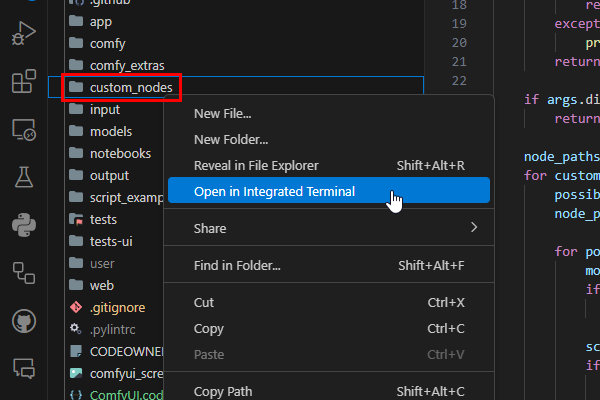
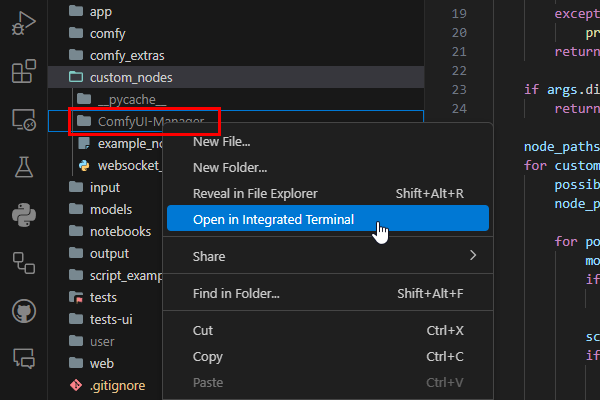
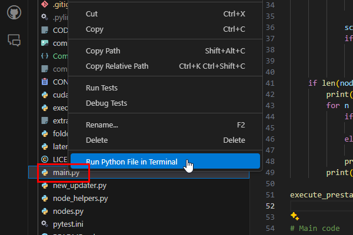

# Topic 1: Fundamentals (WORK IN PROGRESS)

**Note: Everything in this tutorial assumes that you have Nvidia graphics card with CUDA-compatible GPU.**

## Table of Contents

- [Topic 1: Fundamentals (WORK IN PROGRESS)](#topic-1-fundamentals-work-in-progress)
  - [Table of Contents](#table-of-contents)
  - [Conda Commands](#conda-commands)
    - [Environments](#environments)
      - [Creating](#creating)
      - [Listing](#listing)
      - [Activating](#activating)
    - [Conda Packages](#conda-packages)
      - [Installing](#installing)
      - [Searching for Packages](#searching-for-packages)
      - [Listing Installed Packages](#listing-installed-packages)
      - [Deleting Packages](#deleting-packages)
    - [Delete Environment](#delete-environment)
  - [Automatic1111 Setup](#automatic1111-setup)
    - [Step 1. Create Conda Environment for A1111](#step-1-create-conda-environment-for-a1111)
    - [Step 2. Clone Repository](#step-2-clone-repository)
    - [Step 3. Set up Visual Studio Code](#step-3-set-up-visual-studio-code)
    - [Step 4. Activate Conda Environment](#step-4-activate-conda-environment)
    - [Step 5. Run `webui-user.bat` Script](#step-5-run-webui-userbat-script)
  - [ComfyUI Setup](#comfyui-setup)
    - [Step 1. Create Conda Environment for ComfyUI](#step-1-create-conda-environment-for-comfyui)
    - [Step 2. Clone ComfyUI Repository](#step-2-clone-comfyui-repository)
    - [Step 3. Set up VS Code](#step-3-set-up-vs-code)
    - [Step 4. Activate `py311` Environment](#step-4-activate-py311-environment)
    - [Step 5. Install Dependencies](#step-5-install-dependencies)
  - [Kohya GUI Setup](#kohya-gui-setup)
  - [Assignment Solution](#assignment-solution)
    - [Step 1. Create Conda Environment](#step-1-create-conda-environment)

## Conda Commands

### Environments

#### Creating

To create a new conda environment, you can use `create` command:

```sh
conda create --name py310
```

You will be prompted to confirm the creation of the new environment. You can skip the prompt by adding `--yes` flag. For example, let's create a new environment called `py311` and skip the prompt by adding `--yes`:

```sh
conda create --name py311 --yes
```

#### Listing

Normally, the name of the currently active environment is displayed in the brackets in terminal. However, there are situations where you might not see the environment name in the brackets (for example, VS Code terminal). In that case, you can use `conda env list` to list all available environments and find the one that is activated (marked with asterisk `*`).

```sh
conda env list
```

#### Activating

Conda environments can be activated using `activate` command:

```sh
conda activate py310
```

### Conda Packages

#### Installing

Once activated, any package you install will be going into the activated environment. To install packages, use `install` command:

```sh
conda activate py310 # Unless already activated
conda install python
```

You can specify the version of the package you want to install. For example, to install `Python 3.10.6` into the `py310` environment, you can use the following command.

```sh
# As with environment creation, you can skip the prompt by adding `--yes` flag.
conda activate py310
conda install python=3.10.6 --yes
```

You can also install packages into the environment without activating it. For example, to install `Python 3.11.9` into the `py311` environment without activating it, you can use the following command:

```sh
conda install python=3.11.9 --yes --name py311
```

#### Searching for Packages

If you are not sure how to spell the package name, or want to see the package versions available, you can use `search` command:

```sh
conda search python

# Note that you can also use wildcards, if you are not sure about the
# exact package name:
conda search *ython
conda search python=3.10*
```

#### Listing Installed Packages

Just as we have used `conda env list` to list all available environments, you can use `conda list` to list all packages installed in the currently active environment:

```sh
conda list
```

#### Deleting Packages

To remove a package, for example, `cuda` from `py311` environment, you can use:

```sh
conda remove cuda --name py311
```

### Delete Environment

To delete the environment along with all its packages, you can use `remove` command:

```sh
conda remove --name py311 --all --yes
```

## Automatic1111 Setup

### Step 1. Create Conda Environment for A1111

As you recall, Automatic1111 requires Python 3.10.6. Let's create a new environment called `py310` and install Python 3.10.6 into it:

```sh
conda create --name py310

conda activate py310

conda install python=3.10.6
```

### Step 2. Clone Repository

Assuming you have installed `git`, you can clone the repository. Easiest way is to navigate to the folder where you want to clone the repository, right-click and select `Git Bash Here` or `Open in Terminal`. Then you can use `git clone` command to clone the repository:

```sh
git clone https://github.com/AUTOMATIC1111/stable-diffusion-webui.git
```

### Step 3. Set up Visual Studio Code

As shown in the video, you can right-click on the folder and select `Open in Visual Studio Code`. Alternatively, you can open the project by typing `code .` in the terminal (while inside the folder). Save the workspace by choosing `Save Workspace As...` from the `File` menu. This will create a `.code-workspace` file in the folder. You can then open the project by double-clicking on the `.code-workspace` file.

This file is actually a JSON file that contains various settings for the project. For example, if you open the `.code-workspace` file in a text editor, you will see something like this:

```jsonc
{
    "folders": [
        {
            "path": "."
        }
    ],
    "settings": {}
}
```

Any changes made to the workspace settings are reflected in this file. This is convenient, because this lets me share my VS Code configuration with you:

```jsonc
{
    "folders": [
        {
            "path": "."
        }
    ],
    "settings": {
        "editor.fontSize": 16, // Increase font size from 14 to 16
        "files.eol": "\n", // Set the 'end of line' character to '\n' (Unix-style line endings)
        "editor.wordWrap": "on", // Long lines of code are to be wrapped to the next line.
        "editor.defaultFormatter": "ms-python.black-formatter", // 'Black' is popular code formatter for Python.
        "editor.formatOnSave": true, // Each time you save, the code will be formatted.
    },
    "extensions": {
        "recommendations": [
            "ms-python.python", // Python extension
            "ms-python.debugpy", // Python debugger
            "donjayamanne.python-environment-manager", // Python environment manager
            "ms-python.vscode-pylance", // Python language server
            "ms-python.pylint", // Python linter
            "ms-python.black-formatter" // Python code formatter
        ]
    }
}
```

### Step 4. Activate Conda Environment

Using Don Jayamanne's Python Environment Manager, you can set the active workspace environment by clicking the ⭐ icon next to `py310`.


Whenever you open the terminal in this workspace, it will automatically activate the `py310` environment. Note that you won't see the environment name in the brackets, but you can confirm the active environment by running `conda env list` command.

### Step 5. Run `webui-user.bat` Script

Lastly, we will run the script that installs all the dependencies.

```bat
@echo off

set PYTHON=
set GIT=
set VENV_DIR=
set COMMANDLINE_ARGS=

call webui.bat
```

However, **before we run this script**, let's make a few tweaks.

For example, this script automatically creates `venv` virtual environment. Although this is not a problem, it is redundant, since we are already inside conda environment. To avoid creating environment within environment ("dream within a dream within a dream", if get the reference 😉 ) you can specify `VENV_DIR` value as `-`.

Another thing that catches me every time, script downloads Stable Diffusion 1.5 base model (additional 4 GB dowload). You will normally be using fine-tuned model from community. To opt-out from this behavious, you need to add `--no-download-sd-model` to `COMMANDLINE_ARGS`.

Our `webui-user.bat` script will look like this:

```bat
@echo off

set PYTHON=
set GIT=
set VENV_DIR=-
set COMMANDLINE_ARGS=^
    --no-download-sd-model

call webui.bat
```

You should now be able to run the script by right-clicking on the file:


## ComfyUI Setup

### Step 1. Create Conda Environment for ComfyUI

As you recall, ComfyUI requires Python 3.11.9. Let's create a new environment called `py311` and install Python 3.11.9 into it:

```sh
conda create --name py311 --yes

conda activate py311

conda install python=3.11.9 --yes
```

### Step 2. Clone ComfyUI Repository

Assuming you have installed `git`, you can clone the repository. Easiest way is to navigate to the folder where you want to clone the repository, right-click and select `Git Bash Here` or `Open in Terminal`. Then you can use `git clone` command to clone the repository:

```sh
git clone https://github.com/comfyanonymous/ComfyUI.git
```


### Step 3. Set up VS Code

As shown in the video, you can right-click on the folder and select `Open in Visual Studio Code`. Alternatively, you can open the project by typing `code .` in the terminal (while inside the folder). Save the workspace by choosing `Save Workspace As...` from the `File` menu. This will create a `.code-workspace` file in the folder. You can then open the project by double-clicking on the `.code-workspace` file.

Workspace file is actually a JSON file that contains various settings for the project. For example, if you open the `.code-workspace` file in a text editor, you will see something like this:

```jsonc
{
    "folders": [
        {
            "path": "."
        }
    ],
    "settings": {}
}
```

Any changes made to the workspace settings are reflected in this file. This is convenient, because this lets me share my VS Code configuration with you:

```jsonc
{
    "folders": [
        {
            "path": "."
        }
    ],
    "settings": {
        "editor.fontSize": 16, // We increase the font size from 14 to 16 (just my personal preference)
        "files.eol": "\n", // We set the 'end of line' character to '\n' (Unix-style line endings)
        "editor.wordWrap": "on", // Long lines of code are to be wrapped to the next line.
        "editor.defaultFormatter": "ms-python.black-formatter", // 'Black' is popular code formatter for Python.
        "editor.formatOnSave": true, // Each time you save, the code will be formatted.

        "markdownlint.run": "onSave",
    },
    "extensions": {
        "recommendations": [
            "ms-python.python", // Python extension
            "ms-python.debugpy", // Python debugger
            "donjayamanne.python-environment-manager", // Python environment manager
            "ms-python.vscode-pylance", // Python language server
            "ms-python.pylint", // Python linter
            "ms-python.black-formatter" // Python code formatter
        ]
    }
}
```

Once you save this and reopen the VS Code, you will be prompted to install these extensions. Of course, you can also install them manually by clicking on the `Extensions` icon on the left sidebar and searching for the extension name.

### Step 4. Activate `py311` Environment

Using Don Jayamanne's Python Environment Manager, you can set the active workspace environment by clicking the ⭐ icon next to `py311`.


Whenever you open the terminal in this workspace, it will automatically activate the `py310` environment. Note that you won't see the environment name in the brackets, but you can confirm the active environment by running `conda env list` command.

### Step 5. Install Dependencies

Lastly, we will run the script that installs all the dependencies.

Assuming you have Windows, Nvidia graphics card with CUDA-compatible GPU, you run this command first:

```sh
pip install torch torchvision torchaudio --extra-index-url https://download.pytorch.org/whl/cu121
```

The remaining dependencies are listed inside the `requirements.txt` file. You can install them using:

```sh
pip install -r requirements.txt
```

Lastly, you need ComfyUI Manager, which needs to be cloned inside custom_nodes folder. You first right-click on the `custom_nodes` folder and select `Open in Terminal`:



And then you clone the repository:

```sh
git clone https://github.com/ltdrdata/ComfyUI-Manager.git
```

And then you right-click on the `ComfyUI-Manager` folder and select `Open in Terminal`:



And then you install the dependencies:

```sh
pip install -r requirements.txt
```

And you are done. Launch the `main.py` file and you should see the ComfyUI running.




## Kohya GUI Setup

```sh
conda create --name kohya --yes

conda activate kohya

conda install python=3.10.11 --yes

conda install cuda --channel nvidia/label/cuda-11.8.0 --yes
```

The run `setup.bat` file to install the dependencies. Once you are done, you can start GUI by running `gui.bat` file.

## Assignment Solution

In hindsight, this 'assignment' turned out to be way too hard, especially for someone just starting out.

### Step 1. Create Conda Environment

We create a new conda environment, and give it name `comfy3D`:

```sh
conda create --name comfy3D --yes
conda activate comfy3D
conda install python=3.11.9 --yes
```

Since repository requires CUDA 12.1, you were expected to do some research. Eventually, you would discover archived documentation page on Nvidia website regarding CUDA 12.1:

[Using Conda to Install the CUDA Software](https://docs.nvidia.com/cuda/archive/12.1.1/cuda-installation-guide-microsoft-windows/index.html#using-conda-to-install-the-cuda-software).

The command I used was:

```sh
conda install cuda --channel nvidia/label/cuda-12.1.0 --channel nvidia/label/cuda-12.1.1 --yes
```

Clone ComfyUI repository:

```sh
git clone https://github.com/comfyanonymous/ComfyUI.git
```

You install ComfyUI's Nvidia-specific dependencies:

```sh
pip install torch torchvision torchaudio --extra-index-url https://download.pytorch.org/whl/cu121
```

And generel dependencies inside `requirements.txt` file:

```sh
pip install -r requirements.txt
```

Open the `custom_nodes` folder in terminal, and clone Comfy3D repository:


And then you install the dependencies:

```sh
pip install -r requirements.txt
pip install -r requirements_post.txt
pip install xformers --index-url https://download.pytorch.org/whl/cu121
```

If you run `main.py`, everything should now work. It did not work for me though.

I have encountered an error telling me that `roma` and `rembg` are missing. It would seem that the developer did not include `roma` and `rembg` in the `requirements.txt` file. You can install them using:

```sh
pip install roma
pip install rembg
```

If you run `main.py`, everything should now work. It did not work for me though.

I got this error:

> ERROR: pip's dependency resolver does not currently take into account all the packages that are installed. This behaviour is the source of the following dependency conflicts.
> torchaudio 2.3.1+cu121 requires torch==2.3.1+cu121, but you have torch 2.3.0+cu121 which is incompatible.
> torchvision 0.18.1+cu121 requires torch==2.3.1+cu121, but you have torch 2.3.0+cu121 which is incompatible.

I resolved it using the following:

```sh
pip install torch==2.3.0+cu121 torchaudio==2.3.0+cu121 torchvision==0.18.0+cu121 --extra-index-url https://download.pytorch.org/whl/cu121
```

If you run `main.py`, everything should now work.

If you are still having issues, I have exported my environment into a `yaml` file, to make it easier on you.
